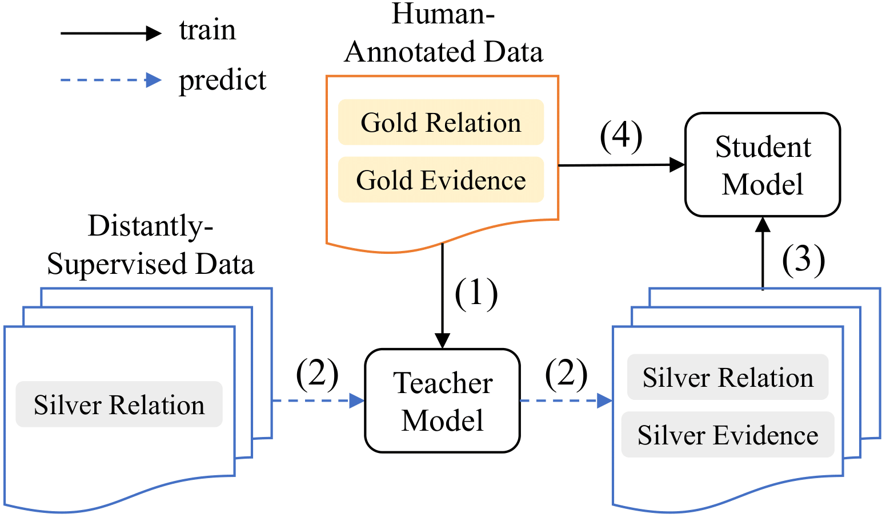

# DREEAM

This repository contains codes for EACL 2023 paper “DREEAM: Guiding Attention with Evidence for Improving Document-Level Relation Extraction”.

The backbone of this project follows [ATLOP](https://github.com/wzhouad/ATLOP)[1] and borrows some of the ideas from [EIDER](https://github.com/veronicium/eider)[2].

## Citation
If you make use of this code in your work, please kindly cite our paper:
```
@inproceedings{ma-etal-2023-dreeam,
    title = "DREEAM: Guiding Attention with Evidence for Improving Document-Level Relation Extraction",
    author = "Ma, Youmi  and
      Wang, An  and
      Okazaki, Naoaki",
    booktitle = "Proceedings of the 17th Conference of the European Chapter of the Association for Computational Linguistics: Main Volume",
    series = {EACL},
    month = may,
    year = "2023",
    address = "Dubrovnik, Croatia",
    publisher = "Association for Computational Linguistics",
    pages = "(to appear)",
}
```

## Requirements

Packages listed below are required.

- Python (tested on 3.8.13)
- CUDA (tested on 11.6)
- [PyTorch](http://pytorch.org/) (tested on 1.11.0)
- [Transformers](https://github.com/huggingface/transformers) (tested on 4.14.1)
- numpy (tested on 1.22.4)
- [opt-einsum](https://github.com/dgasmith/opt_einsum) (tested on 3.3.0)
- wandb
- ujson
- tqdm

It is also possible to setup the environment by `pip install -r requirements.txt`.

## Dataset

The [DocRED](https://www.aclweb.org/anthology/P19-1074/) dataset can be downloaded following the instructions at [link](https://github.com/thunlp/DocRED/tree/master/data). The expected structure of files is:

```
DREEAM
 |-- dataset
 |    |-- docred
 |    |    |-- train_annotated.json
 |    |    |-- train_distant.json
 |    |    |-- dev.json
 |    |    |-- test.json
 |    |    |-- (train_revised.json)
 |    |    |-- (dev_revised.json)
 |    |    |-- (test_revised.json)
 |-- meta
 |    |-- rel2id.json
 |    |-- rel_info.json

```

## Training

### Fully-supervised Setting

To train DREEAM under a fully-supervised setting, make sure the file structure is the same as above, and run below:

```bash
bash scripts/run_bert.sh ${name} ${lambda} ${seed} # for BERT
bash scripts/run_roberta.sh ${name} ${lambda} ${seed} # for RoBERTa
```

where `${name}` is the identifier of this run displayed in wandb, `${lambda}` is the scaler than controls the weight of evidence loss (see Eq. 11 in the paper), and `${seed}` is the value of random seed.

The training loss and evaluation results on the dev set are synced to the wandb dashboard. All the outputs including the checkpoints, predictions and evaluation scores will be stored under a directory named `${name}_lambda${lambda}/${timestamp}/` , where `${timestamp}` is the time stamp automatically generated by the code.

### Weakly-supervised setting

We follow the diagram below to train DREEAM under a weakly-supervised setting.

 

Here, we assume that a teacher model has been trained under fully-supervised setting (step 1)as described in the above sub-section. 

### Step 2: Infer on distantly-supervised data

Then, we need to use the trained teacher model to infer token importance on the distantly-supervised data. To do so, please run below:

```bash
bash scripts/infer_distant_bert.sh ${name} ${load_dir} # for BERT
bash scripts/infer_distant_roberta.sh ${name} ${load_dir} # for RoBERTa
```

where `${name}` is the identifier of this run displayed in wandb and `${load_dir}` is the directory that contains the checkpoint. The command will perform an inference run on `train_distant.json` and record token importances as `attns.pt` saved under `${load_dir}`.

### Step 3: Self-Training on distantly-supervised data

After that, we utilize the recorded token importance as supervisory signals for the self-training of the student model. To do so, please run the commands below:

```bash
bash scripts/run_self_train_bert.sh ${name} ${teacher_signal_dir} ${lambda} ${seed} # for BERT
bash scripts/run_self_train_roberta.sh ${name} ${teacher_signal_dir} ${lambda} ${seed} # for RoBERTa
```

where `${name}` is the identifier of this run displayed in wandb, `${teacher_signal_dir}` is the directory that stores the `attn.pt` file, `${lambda}` is the scaler than controls the weight of evidence loss (see Eq. 13 in the paper), and `${seed}` is the value of random seed.

All the outputs including the checkpoints, predictions and evaluation scores will be stored under a directory named `${name}_lambda${lambda}/${timestamp}/` , where `${timestamp}` is the time stamp automatically generated by the code.

### Step 4: Fine-tuning on human-annotated data

Finally, we fine-tune the model on human-annotated data with commands below:

```bash
bash scripts/run_finetune_bert.sh ${name} ${student_model_dir} ${lambda} ${seed} # for BERT
bash scripts/run_finetune_roberta.sh ${name} ${student_model_dir} ${lambda} ${seed} # for RoBERTa
```

where `${name}` is the identifier of this run displayed in wandb and`${teacher_signal_dir}` is the directory that stores the checkpoint of student model.

All the outputs including the checkpoints, predictions and evaluation scores will be stored under a directory named `${name}_lambda${lambda}/${timestamp}/` , where `${timestamp}` is the time stamp automatically generated by the code.

## Evaluation

### Dev set

We adopt the inference-Stage Fusion strategy from EIDER [2] to utilize the evidence predictions. To do so, we first need to obtain a threshold that minimizes the cross-entropy loss of RE on development set as below.

```bash
bash scripts/ifs_bert.sh ${name} ${model_dir} dev # for BERT
bash scripts/ifs_roberta.sh ${name} ${model_dir} dev # for RoBERTa
```

where `${name}` is the identifier of this run displayed in wandb and `${model_dir}` is the directory that contains the checkpoint we are going to evaluate. The commands have two functions:

1.  perform inference-stage fusion on the development data, return the scores and dump the predictions into `${model_dir}/`;
2. Select the threshold and record it as `${model_dir}/thresh`.

### Test set

With `${model_dir}/thresh` available, we can make predictions on test set with the commands below:

```bash
bash scripts/ifs_bert.sh ${name} ${model_dir} test # for BERT
bash scripts/ifs_roberta.sh ${name} ${model_dir} test # for RoBERTa
```

where `${model_dir}` is the directory that contains the checkpoint we are going to evaluate. The program will generate a test file `result.json` in the official evaluation format. Feel free to compress and submit it to [Colab]([https://codalab.lisn.upsaclay.fr/competitions/365](https://codalab.lisn.upsaclay.fr/competitions/365#results)) for the official test score.

## References

```
[1]Wenxuan Zhou, Kevin Huang, Tengyu Ma, and Jing Huang. 2021. Document-level relation extraction with adaptive thresholding and localized context pool- ing. In Proceedings of the AAAI Conference on Arti- ficial Intelligence.
[2]Yiqing Xie, Jiaming Shen, Sha Li, Yuning Mao, and Jiawei Han. 2022. Eider: Empowering document- level relation extraction with efficient evidence ex- traction and inference-stage fusion. In Findings of the Association for Computational Linguistics: ACL 2022, pages 257–268, Dublin, Ireland. Association for Computational Linguistics.
```
